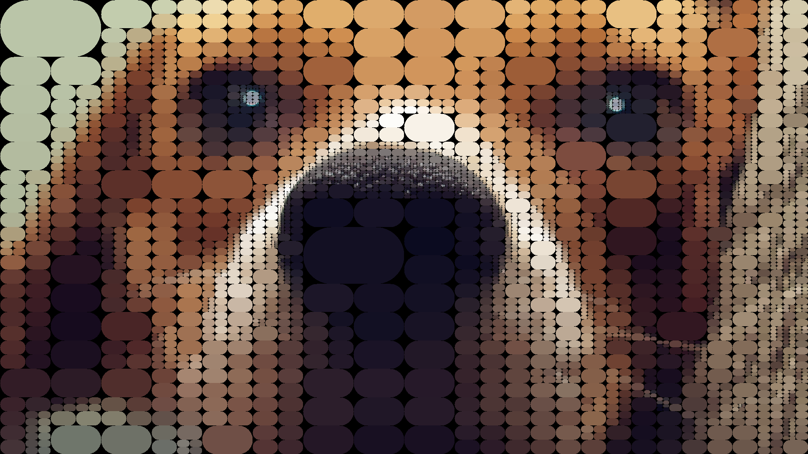

# quads.js

Shameless clone in Node.js of @fogleman's
[Quads](https://github.com/fogleman/Quads). Especially the color
distance formula, since I couldn't get one to work well until I used
his. However, @fogleman uses Python builtin images library, which
already provides cropping and histograms for a cropped part of an
image.

Node.js does not provide any of those, so I used
[pngjs](https://github.com/niegowski/node-pngjs) for loading and
saving PNG,
[js-priority-queue](https://github.com/adamhooper/js-priority-queue)
for the Priority Queue (choosing the node with the greatest error,
taking area into account) and the dynamic programming algorithm for 2D
submatrix sum (O(N<sup>2</sup>) setup, O(1) lookup).

You can see examples of this working in the original
[Quads](https://github.com/fogleman/Quads) repository. He also has a
script to convert the generated frames to gif animations and has the
option to paint circles and rounded rectangles, try it out.

If you find this project useful and want other options implemented (other formats, canvas, scaling...), leave a feature request and I'll see if I can work it out. Cheers!

# Usage

```bash
  node quads.js <filename> [options]
```

Find out about the syntax using:

```bash
  node quads.js --help
```

Currently, it is possible to enable borders, specify maximum number of
node expansions (iterations), change the required error difference
between frames, shape of nodes (rectangles or rounded/circles) and
color of background and borders (when enabled).

Iterations defaults to 1024, and error threshold defaults to 0.5.
With a greater number of iterations the script will generate more
frames (or not, if the error is already very low, near the threshold)
and with a greater threshold less frames will be generated for splits
that reduce the error very little.

# Differences with original repository

Besides the aforementioned missing features in this project, this
script does not limit the depth or size of each node in the QuadTree,
so the results may vary a little. I provided a commandline option to
turn on the borders (sometimes they are great, other times the result
without borders is much nicer) and I plan to experiment with color
distance formulae, different borders (maybe colorful ones) and maybe
use [gifencoder](https://github.com/eugeneware/gifencoder) to generate
the gifs from the script.

# Samples




# TODO

- Use [getopt](https://www.npmjs.com/package/node-getopt) to have a nicer CLI.
- Implement configurable depth limit in the QuadTree.
- Tests? I should test the QuadTree.

# License

MIT license, do as you wish.
